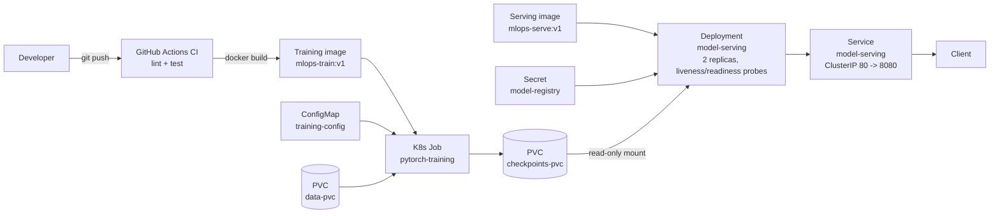

# MLOps PyTorch Pipeline

**Author:** Sumedh (DA25G523)

A CIFAR-10 image classifier taken through the full MLOps lifecycle: local development, Docker, and Kubernetes.

## Overview

The model classifies 32×32 RGB images into 10 CIFAR-10 classes. Architecture
(`resnet18` or `simplecnn`) and all hyperparameters are read at runtime from
[`configs/training_config.yaml`](configs/training_config.yaml) — nothing is
hardcoded in `src/`. Training (`src/train.py`) logs one JSON object per line
to stdout and checkpoints the best model; serving (`src/serve.py`) is a
FastAPI app exposing `/predict` and `/health`. Both ship as separate,
minimal Docker images and run on Kubernetes as a training `Job` followed by
an autoscaled serving `Deployment`.

## Repository layout

```
README.md                        This file
REFLECTION.md                    Assignment reflection
.gitignore                       Ignored files (checkpoints, data, caches, secrets, etc.)
.github/workflows/ci.yml         CI: lint (ruff) + tests (pytest)
pyproject.toml                   pytest/ruff configuration
src/
  train.py                       Training loop, JSON-lines metrics, checkpointing, early stopping
  model.py                       get_model(architecture, num_classes) — resnet18 / simplecnn
  dataset.py                     CIFAR-10 dataset, transforms, dataloaders
  serve.py                       FastAPI inference service (/predict, /health)
configs/
  training_config.yaml           Model architecture + hyperparameters (single source of truth)
docker/
  Dockerfile.train                Training image
  Dockerfile.serve                Serving image
k8s/
  namespace.yaml                  `ml-training` namespace
  configmap.yaml                  Training config as a ConfigMap
  training-job.yaml               data-pvc, checkpoints-pvc, and the training Job
  serving-deployment.yaml         `model-serving` Deployment
  serving-service.yaml            `model-serving` Service (port 80 -> 8080)
  hpa.yaml                        HorizontalPodAutoscaler for serving
  secret.yaml                     Placeholder Secret for the serving layer
requirements/
  train.txt                       Pinned training dependencies
  serve.txt                       Pinned serving dependencies
tests/
  test_model.py                   Unit tests for get_model
```

## Prerequisites

- Python 3.11
- Docker
- A local Kubernetes cluster (e.g. `kind`, `minikube`, or Docker Desktop's
  Kubernetes) and `kubectl`
- `kubectl` context pointing at that cluster

### Installing prerequisites

<details>
<summary><strong>macOS</strong> (Homebrew)</summary>

```bash
brew install python@3.11
brew install --cask docker   # Docker Desktop; enable Kubernetes in
                              # Settings > Kubernetes, or use kind/minikube below
brew install kubectl
brew install kind            # or: brew install minikube
```

</details>

<details>
<summary><strong>Linux</strong> (Ubuntu/Debian)</summary>

```bash
sudo apt update
sudo apt install -y python3.11 python3.11-venv python3-pip

# Docker Engine
curl -fsSL https://get.docker.com | sh
sudo usermod -aG docker "$USER"   # log out/in for this to take effect

# kubectl
curl -LO "https://dl.k8s.io/release/$(curl -L -s https://dl.k8s.io/release/stable.txt)/bin/linux/amd64/kubectl"
sudo install -o root -g root -m 0755 kubectl /usr/local/bin/kubectl

# kind
curl -Lo ./kind https://kind.sigs.k8s.io/dl/v0.23.0/kind-linux-amd64
chmod +x ./kind && sudo mv ./kind /usr/local/bin/kind
```

</details>

<details>
<summary><strong>Windows</strong></summary>

Easiest path: install [WSL2](https://learn.microsoft.com/windows/wsl/install)
with an Ubuntu distro and follow the Linux instructions above inside it —
Docker Desktop's WSL2 backend then shares images/containers with that shell.

Native (PowerShell, via [winget](https://learn.microsoft.com/windows/package-manager/winget/)):

```powershell
winget install -e --id Python.Python.3.11
winget install -e --id Docker.DockerDesktop
winget install -e --id Kubernetes.kubectl
winget install -e --id Kubernetes.kind
```

Docker Desktop can also enable a built-in single-node Kubernetes cluster
(Settings > Kubernetes) instead of `kind`/`minikube`.

</details>

## Local development

```bash
python3.11 -m venv .venv
source .venv/bin/activate
pip install -r requirements/serve.txt   # superset of train.txt minus tensorboard, see below
pip install ruff pytest

ruff check .
pytest -q
```

To actually train, install the training-only extras and run:

```bash
pip install -r requirements/train.txt
python src/train.py
```

Note: `configs/training_config.yaml` points `data.data_dir` and
`output.checkpoint_dir` at the container paths `/app/data` and
`/app/checkpoints` (there's no CLI override — the config is the single
source of truth). To run training on bare metal rather than in the
container, either create those absolute directories with write access
(`sudo mkdir -p /app/data /app/checkpoints && sudo chown "$USER" /app/data /app/checkpoints`)
or temporarily point both paths at local directories (e.g. `./data`,
`./checkpoints`) in your local copy of the config — don't commit that edit.

To serve locally once you have a checkpoint:

```bash
CHECKPOINT_PATH=./checkpoints/classifier_v1.pt python src/serve.py
curl http://localhost:8080/health
curl -X POST -F "image=@some_image.png" http://localhost:8080/predict
```

## Docker

Build (run from the repo root so `src/`, `configs/`, `requirements/` are all
in the build context):

```bash
docker build -f docker/Dockerfile.train -t mlops-train:v1 .
docker build -f docker/Dockerfile.serve -t mlops-serve:v1 .
```

Run training, mounting local `data/` and `checkpoints/` directories:

```bash
mkdir -p data checkpoints
docker run --rm \
  -v "$(pwd)/data:/app/data" \
  -v "$(pwd)/checkpoints:/app/checkpoints" \
  mlops-train:v1
```

Run serving against the checkpoint just produced:

```bash
docker run --rm -p 8080:8080 \
  -v "$(pwd)/checkpoints:/app/checkpoints:ro" \
  mlops-serve:v1
```

```bash
curl http://localhost:8080/health
curl -X POST -F "image=@some_image.png" http://localhost:8080/predict
```

## Kubernetes

Load the two images into your local cluster (e.g. for `kind`:
`kind load docker-image mlops-train:v1 mlops-serve:v1`) — both manifests use
`imagePullPolicy: IfNotPresent` and expect the images to already be present
on the node rather than pulled from a registry.

Apply in order — the training `Job` must complete and write a checkpoint to
`checkpoints-pvc` before the serving `Deployment` can become ready:

```bash
kubectl apply -f k8s/namespace.yaml
kubectl apply -f k8s/configmap.yaml
kubectl apply -f k8s/secret.yaml
kubectl apply -f k8s/training-job.yaml     # also creates data-pvc, checkpoints-pvc

kubectl wait --for=condition=complete job/pytorch-training -n ml-training --timeout=600s

kubectl apply -f k8s/serving-deployment.yaml
kubectl apply -f k8s/serving-service.yaml
kubectl apply -f k8s/hpa.yaml
```

Check status and try it out:

```bash
kubectl get pods,jobs,deploy,svc,hpa -n ml-training

kubectl port-forward -n ml-training svc/model-serving 8080:80
curl http://localhost:8080/health
curl -X POST -F "image=@some_image.png" http://localhost:8080/predict
```

## ConfigMaps and Secrets

- **ConfigMap** (`k8s/configmap.yaml`, `training-config`) holds
  `training_config.yaml` — the same architecture/hyperparameter/path
  settings from [`configs/training_config.yaml`](configs/training_config.yaml).
  It's mounted into the training `Job` at `/app/configs`, so hyperparameters
  can change without rebuilding the training image. The serving `Deployment`
  is not given this ConfigMap; it uses the copy baked into the
  `mlops-serve:v1` image at the same path.
- **Secret** (`k8s/secret.yaml`, `model-registry`) holds a placeholder
  `MODEL_REGISTRY_TOKEN`, injected into the serving container as an
  environment variable via `secretKeyRef`. It only demonstrates wiring a
  Secret into a workload — the committed value is a dummy, real secrets are
  excluded from git (see `.gitignore`: `.env`, `secrets/`, `*.local.yaml`)
  and must be supplied out-of-band (`kubectl create secret`, a secrets
  manager, etc.).

## Architecture



## Reproducing these results

A full local run, start to finish — training a model, then serving and
querying it. This is the same flow as [Local development](#local-development)
and [Docker](#docker) above, laid out as one ordered checklist; use the
Docker or Kubernetes sections instead if you want the containerized or
cluster version.

1. Clone the repo and `cd` into it.
2. Create and activate a virtualenv, then install training dependencies:
   ```bash
   python3.11 -m venv .venv
   source .venv/bin/activate        # Windows: .venv\Scripts\activate
   pip install -r requirements/train.txt
   ```
3. The config points `data_dir`/`checkpoint_dir` at `/app/data`/`/app/checkpoints`.
   For a bare-metal run, either create those (`sudo mkdir -p /app/data /app/checkpoints
   && sudo chown "$USER" /app/data /app/checkpoints`) or temporarily edit
   `configs/training_config.yaml` to point both at local paths (e.g. `./data`,
   `./checkpoints`) — don't commit that edit.
4. Train:
   ```bash
   python src/train.py
   ```
   Stdout is one JSON object per line, one per epoch:
   ```json
   {"epoch": 1, "train_loss": 1.6123, "train_accuracy": 0.4108, "val_loss": 1.3927, "val_accuracy": 0.4981}
   ```
   (values above are illustrative of the shape, not real numbers) followed
   by a `{"event": "checkpoint_saved", ...}` line whenever validation loss
   improves, and ending with `{"event": "training_complete", "best_val_loss": ...}`
   — either after `training.epochs` epochs or once `early_stopping_patience`
   is exhausted.
5. Confirm the checkpoint landed where the config said it would, e.g.
   `ls -la /app/checkpoints/classifier_v1.pt`.
6. Install serving dependencies and start the API, pointing it at that
   checkpoint:
   ```bash
   pip install -r requirements/serve.txt
   CHECKPOINT_PATH=/app/checkpoints/classifier_v1.pt python src/serve.py
   ```
7. In another terminal, verify it's up and get a prediction:
   ```bash
   curl http://localhost:8080/health
   # {"status":"ok"}

   curl -X POST -F "image=@some_image.png" http://localhost:8080/predict
   # {"predictions": {"airplane": 0.01, ..., "truck": 0.02}, "top_class": "..."}
   ```
8. Run the test suite:
   ```bash
   pytest -q
   ```

## CI/CD

`.github/workflows/ci.yml` runs on every push and pull request to `develop`
and `main`, with two independent jobs:

- **lint** — installs `ruff` and runs `ruff check .`
- **test** — installs `requirements/serve.txt` + `pytest` and runs `pytest -q`

## Testing

```bash
pytest -q
```

`tests/test_model.py` covers `get_model` for both supported architectures
and the `ValueError` on an unknown one; it never imports `dataset.py`, so no
CIFAR-10 download happens in CI.
